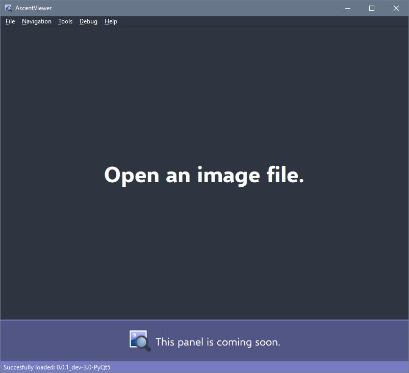

# AscentViewer

**AscentViewer** is a powerful **image viewer** written in **Python** using [**PyQt**](https://riverbankcomputing.com/software/pyqt/) and [**several other libraries.**](other/markdown/CREDITS.md)

Here is [**its website**](https://dd.acrazytown.com/AscentViewer/).

---

## Possible switch to C++ Qt

There is a high possibility that we will switch from PyQt to native C++ Qt, due to various reasons, such as:

* More documentation
* Speed and control
* etc.

If we do decide to switch to native C++ Qt, we'll make a stable Python version, and then archive it (put it in a different branch, like old DDIV).

## What happened to DDIV?

DDIV got renamed to "**AscentViewer**".

The main reason for that is that [**DespawnedDiamond**](https://github.com/despawnedd) (the owner) is not the only one working on it anymore, and the second reason is that "AscentViewer" just sounds cooler!

Looking for old, pre-rename/Old Pre-release Beta code? Check out the [**"pre-rename" branch.**](https://github.com/despawnedd/AscentViewer/tree/pre-rename)

---

## Screenshots

*AscentViewer 0.0.1_dev-2.0-PyQt5*

## Credits

Credits are coming soon.

## Documentation

It's coming soon, just like the credits.

## Release version naming info

Each version name consists of four elements:

- major version number
- minor version number
- revision number
- additional info (such as the branch)

e.g. **1.0.3_dev-1.3**

*Will add more info about this later.*

<!-- ### Version Structure (a.b.c-bld-rev_rl)

"**a**" is the **major version** number (e.g. "**1.0.0**").

"**b**" is the **minor version** number (e.g. "**1.3.0**").

"**c**" is the **match version** number (e.g. "**1.3.8**").

"**bld**" is the **build version** number (e.g. "**1.3.8-201204**") (*The build number's pretty much the date the "build" was made in, formatted like this: last two digits of the  year + month + day*).

"**rev**" is the **revision number** of that build. This will only be used in cases that there are several builds in one day. (e.g. "**1.3.8-201204-4**").

"**rl**" is the **release branch** indicator (eg. "**1.3.8-201204-4_master**") -->
