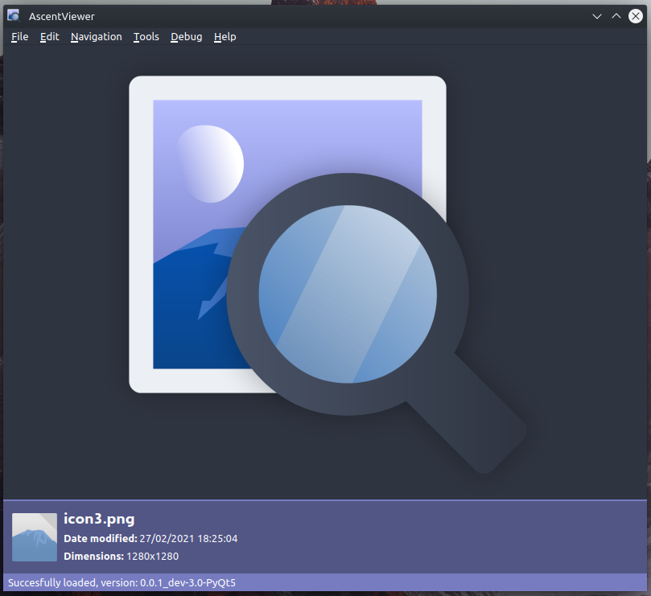
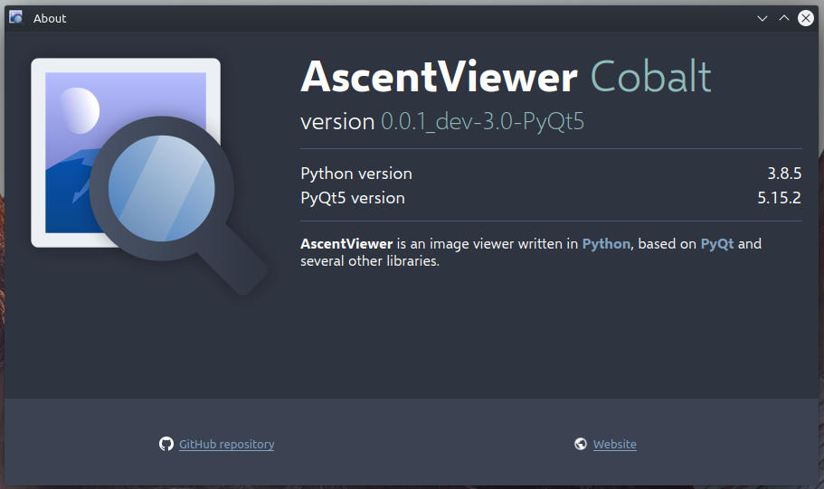

# AscentViewer

**AscentViewer** is an image viewer written in [Python](https://www.python.org/) based on [PyQt](https://riverbankcomputing.com/software/pyqt/) and [several other libraries.](CREDITS.md)

Here is [its website](https://dd.acrazytown.com/AscentViewer/).

---

<!-- NOTE: Add notice about downloads. -->

## What happened to DDIV?

DDIV got renamed to **AscentViewer**.

The main reason for that is that the owner of the program, [DespawnedDiamond](https://github.com/despawnedd), is not the only one working on it anymore (DDIV was short for <u>*DespawnedDiamond's*</u> *Image Viewer*"), and the second reason is that "AscentViewer" just sounds better.

Looking for old, pre-rename/Old Pre-release Beta code? Check out the ["pre-rename" branch.](https://github.com/despawnedd/AscentViewer/tree/pre-rename)

---

## Screenshots

> *AscentViewer's main window*

> *AscentViewer's about window*

## How to run/install

You can either use one of the prebuilt binaries in one of the [Releases](https://github.com/despawnedd/AscentViewer/releases), or you could run the raw Python version.

Here are the instructions for running the raw Python version:

### Windows

* Install Python 3.7 or higher from [here](https://www.python.org/downloads/).
* Run `py -m pip install -r requirements.txt` (or `pip install -r requirements.txt` if you [added Python to PATH](misc/markdown/img/add_to_path_win.png))
* Run [AscentViewer.py](source/AscentViewer.py).

### macOS

macOS usually comes with a copy of Python but that's an old version which isn't supported.

The procedure is the same as on Windows:

* Download and install Python 3.7 or higher from [here](https://www.python.org/downloads/).
* Run `python3 -m pip install -r requirements.txt`.
* Run [AscentViewer.py](source/AscentViewer.py).

### Linux

* Install Python 3.7 or higher. The recommended way to do so is by installing it using a package manager, such as apt (`apt install python3`). Note: using a package manager might require administrator access.
* You might also have to install qt5-default (for apt, the command is `apt install qt5-default`).
* Run `python3 -m pip install -r requirements.txt`.
* Run [AscentViewer.py](source/AscentViewer.py).

<!-- ### Windows

* Install Python 3.7 or higher somehow. The recommended way to do so is by downloading it from Python's official website:
  * Download Python 3.7 or higher from [Python's website](https://www.python.org/downloads/).
  * Install the downloaded Python version (make sure you select the [Add to PATH  checkbox](misc/markdown/img/add_to_path_win.png))
* Run [ascv.py](source/ascv.py), either by opening it in File Explorer (if you installed the [Python launcher()]), or by running it from the command line.

### macOS

Detailed instructions for macOS are coming soon

### Linux

> Please correct me if something is wrong here by creating an issue or a pull request.

* Install Python 3.7 or higher, either by building it from source, or by installing it using your favourite package manager, such as apt (``sudo apt install python3``).
* You might have to install ``qt5-default``. Again, install it by using your favourite package manager, such as apt (``sudo apt install qt5-default``).
* Run [ascv.py](source/ascv.py) using the Python version you installed. If you installed it using a package manager (of if you have added it to PATH yourself), this can be done by running ``python3 [path to ascv.py]`` (eg. ``python3 ascv.py``) -->

**tl;dr:** Install Python, and then run [AscentViewer.py](source/AscentViewer.py).

<!-- * Install Python 3.7+ (make sure you install ``pip``)
* Run ``pip install -r requirements.txt`` while in the root directory, or just manually install the required packages
* If you're on Linux, you might have to install ``qt5-default`` (on Ubuntu, the command is ``sudo apt install qt5-default``) 

And that's it. -->

## Credits

You can read the credits [here](CREDITS.md).

## Documentation

You can read the documentation [here](https://github.com/despawnedd/AscentViewer/wiki).

## Release version naming info

Each version name consists of four elements:

* major version number
* minor version number
* revision number
* additional info (such as the branch, the pre-release version number, etc.)

e.g. **1.0.3_dev-1.3**
